# **AFRO EXPERIENCE**

AFRO EXPERIENCE is a periodic event that aims to bring the best of afro-beats and african music to Swansea, U.K.
The AFRO EXPERIENCE website is designed to provide information about the event, showcase photos and videos from past events, and allow potential sponsors and performers to get in touch with us.

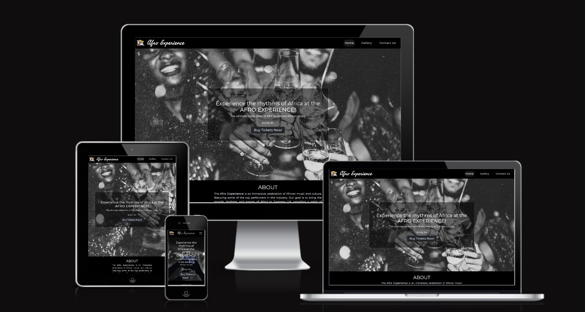
The above website screenshot was generated using [ui.dev/amiresponsive](https://ui.dev/amiresponsive)

To view the live website on GitHub Pages click [Afro-Experience](https://nelkon01.github.io/afro_experience_website/index.html)

# Contents

* [**Objective**](<#objective>)
* [**User Experience**](<#user-experience-ux>)
  * [**User Stories**](<#user-stories>)
  * [**Wireframes**](<#wireframes>)
  * [**Structure**](<#structure>)
  * [**Design**](<#design>)
    * [**Colour Scheme**](<#colour-scheme>)
    * [**Typography**](<#typography>)
    * [**Imagery**](<#imagery>)
* [**Features**](<#features>)
  * [**Existing Features**](<#existing-features>)
    * [**Navigation Bar**](<#navigation-bar>)
    * [**Hero Image**](<#hero-image>)
    * [**About Section**](<#about-section>)
    * [**Event Details**](<#event-details-section>)
    * [**Featured Performers**](<#featured-performers-section>)
    * [**Attendees Quotes**](<#attendees-quotes-section>)
    * [**Footer**](<#footerr>)
    * [**Gallery**](<#gallery>)
    * [**Contact Page**](<#contact-page>)
    * [**Responsiveness**](<#responsiveness>)
* [**Technologies Used**](<#technologies-used>)
* [**Testing**](<#testing>)
* [**Testing User Stories**](<#testing-user-stories-from-user-experience-ux-section>)
* [**Validator Testing**](<#validator-testing>)
  * [**index.html**](<#indexhtml>)
  * [**gallery.html**](<#galleryhtml>)
  * [**contact.html**](<#contacthtml>)
  * [**style.css**](<#stylecss>)
* [**Deployment**](<#deployment>)
* [**Credits**](<#credits>)
  * [**Content**](<#content>)
  * [**Media**](<#media>)
* [**Acknowledgments**](<#acknowledgments>)

# **Objective**
To fufil the requirements of my portfolio project one, I am developing this website to provide information about an Afro-Beats periodic event. This website is indended to demonstrate competency in usercentric frontend web development using HTML and CSS. This project will also showcase my attention to details and the importance of thorough testing. 

# **User Experience (UX)**

-   ## **User stories**

    -   ### First Time Visitor Goals:

        1. As a First Time Visitor, I want to easily understand the main purpose of the site and learn more about the event.

        2. As a First Time Visitor, I want to be able to easily navigate through the site to buy tickets for the next event.

        3. As a First Time Visitor, I want to be able to easily be able to navigate throughout the site to find content.

        4. As a First Time Visitor, I want to look for testimonials to understand what previous atendees think of te event and see if they are trusted. I also want to locate their social media links to see their following on social media to determine how trusted and known they are.    

    -   ### Returning Visitor Goals:

        1. As a Returning Visitor, I want to ensure the details and information about the event is still the same.
        2. As a Returning Visitor, I want to find the best way to get in contact with the event organisers for sponsorship oppotunities or enquiries.

    -   ### Frequent User Goals:

        1. As a Frequent User, I want to check to see if there are any new events coming up.
-   ## **Wireframes**
    ### Mobile
    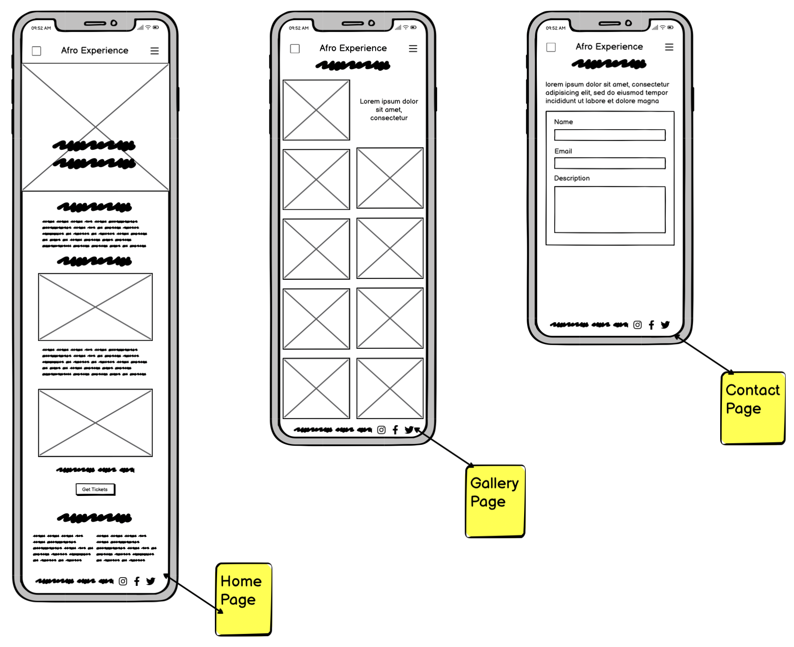
    ### Tablet
    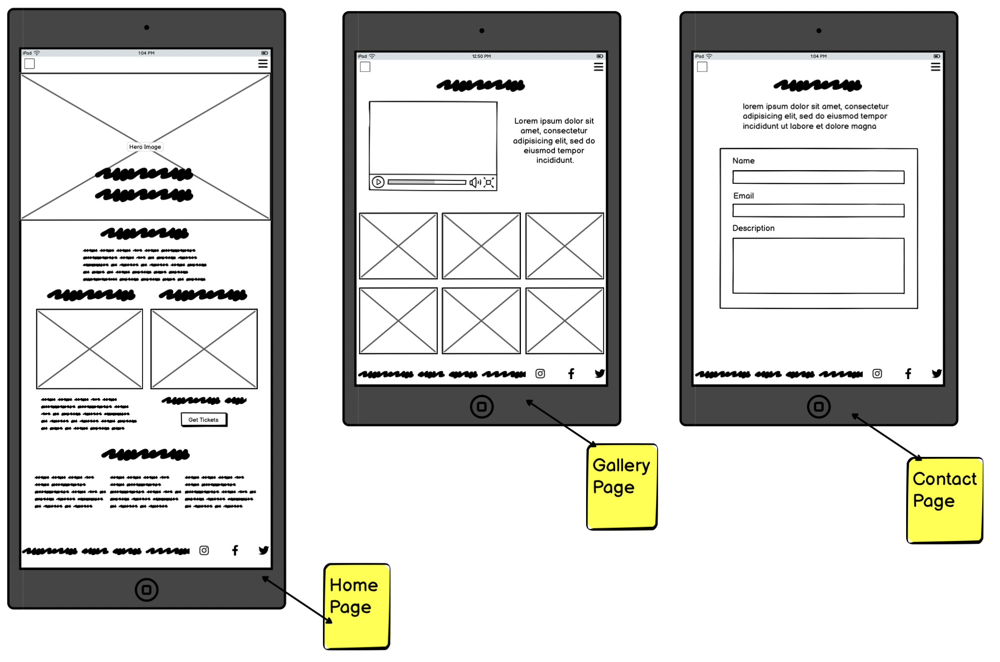
    ### PC
    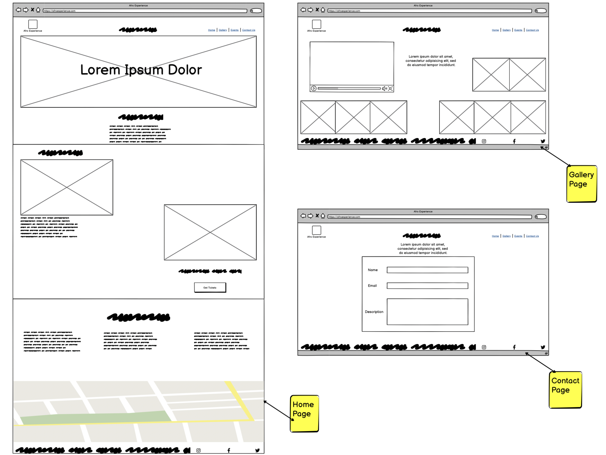
-   ## **Structure**

    Afro Experience website is a 4 page website where 3 of the pages has it's own navigation link in the navbar at the top of the page. The [Home Page](https://nelkon01.github.io/afro_experience_website/index.html) is the default landing page. The user can easily navigate to the [Gallery](https://nelkon01.github.io/afro_experience_website/gallery.html) and the [Conntact Page](https://nelkon01.github.io/afro_experience_website/contact.html) via the navigation links on all devices. The [Thanks Page](https://nelkon01.github.io/afro_experience_website/thanks.html?first_name=fef&last_name=fef&email_address=adeniyioyenekan%40gmail.com&contact-type=enquiries&details=fefe) is only accessible upon suucessful completion of the contact form. 


-   ## **Design**
    -   ### Colour Scheme
        -   The main color scheme used here is black, which was was chosen to maintain the club-nights nature of the event theme. 
        -   The colors used are Black, Navy Blue, Orangered and white for the text.
    -   ### Typography
        -   The [Montserrat](https://fonts.google.com/specimen/Montserrat?query=mont) font is the main font used throughout the whole website with Sans Serif as the fallback font in case for any reason the font isn't being imported into the site correctly. Montserrat is a clean font used frequently in programming, so it is both attractive and appropriate.
        -    The [Fasthand](https://fonts.google.com/specimen/Fasthand?query=fasthand) font was used for the Website heading. 
    -   ### Imagery
        -   Imagery is important. The large, background hero image is a pictured image which is striking will catch the user's attention to represent fun nature of the event. 
        -   Images from past events have also been included in a gallery page of the website to how further evidence of what the event is about and how well attended they are. 

# **Features**
      
The Afro Experience website includes very useful features as listed below. They include familiar functionalities such as navigation, gallery and contact form. The website is designed for users to experience ease of use in browsing and navigating through the website. It takes the mobile first approach to website design acknowledging the fact that most web users in the world at the momemnt consume web content on their mobile phione.

## **Existing Features**

  ### **Navigation Bar**

  The logo and website name is situated at the top of the website and redirects the user to the homepage which represents good user experience. The Logo was created using [BrandCrowd's](https://www.brandcrowd.com/) free online logo maker. The Brand text is [Fasthand](https://fonts.google.com/specimen/Fasthand?query=fasthand) which was imported into the project using Google fonts.

  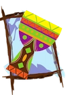

  - #### Mobile
    This wsebsite was developed taking the mobile first approach, therefore i ensured that the website doesnt lose any functionality regardless of the device the user is engaging with. The nav items collapses into a hamburger button that expands when clicked by the user to reveal the nav items. 

    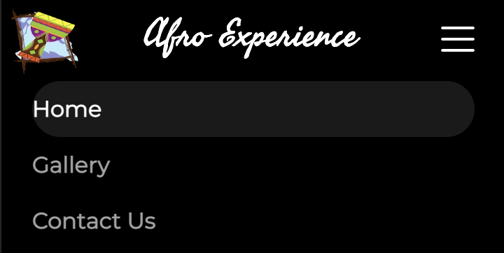

  - #### Tablets and Desktop
An easy looking navigation menu is implemented on Larger screens above 575px breakpoint which revels the nav items in a nice and easily accesible way. Using the `.active` class on the current page allows the user to see which page they are currently on via a brighter highlight on the active page in the navigation and a ligher background.


### **Hero image**

The website was deleveloped with hero images that help give users a visual representation of the nature of the event and its club-nights theme. There is a slightly transparent overlay at the center of the hero image which houses a strong message for the event, and the tagline for users to easily see, as well as a call to action button that prompts users to purchase tickets immediately. To achieve full responsiveness without losing the main appeal of the hero image, I chose to use different images which loads up on mobile devices and larger screen devices as shown in the screenshots below. 

- ### Mobile
    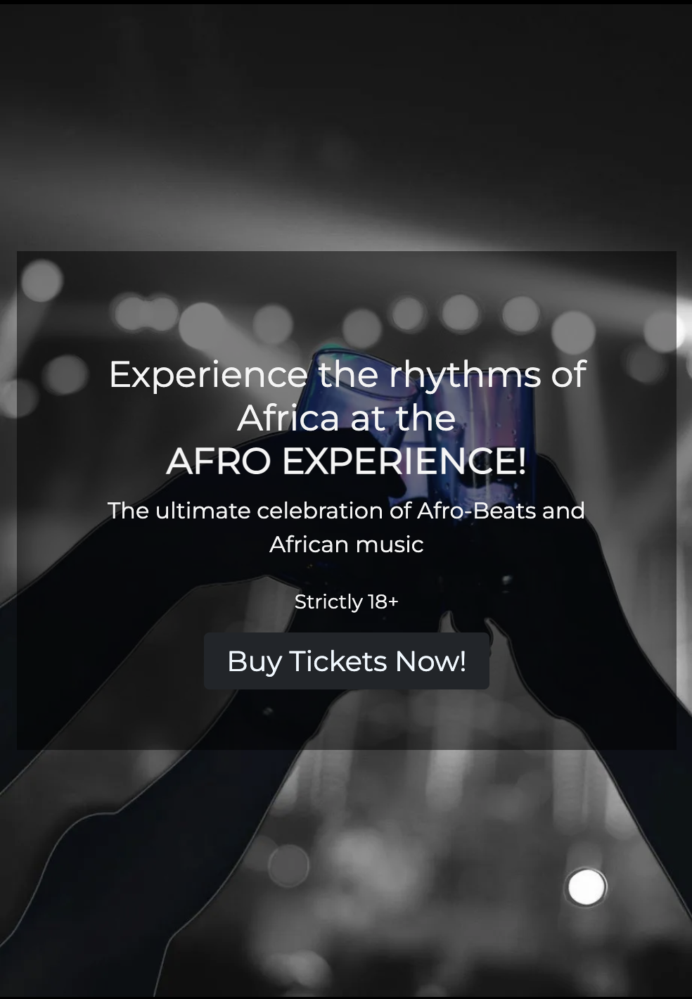

- ### Desktop
    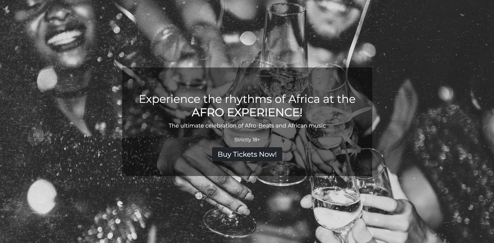

### **About Section**

    This includes a h2 and a concise paragraph describing the event and what the event is trying to achieve, and the organisers rationale for puting up the event. 
    
- ### Mobile
    
 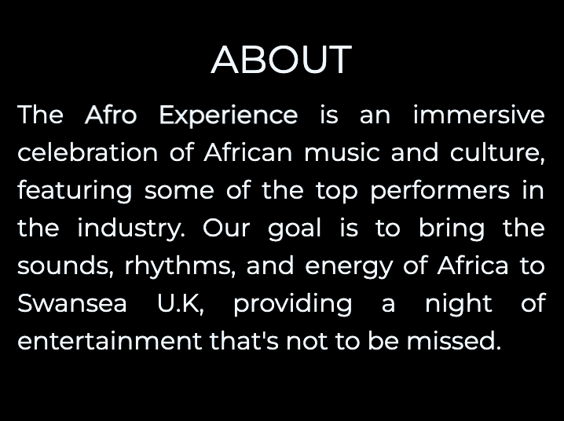

- ### Desktop


### **Event Details Section**

This section is where the event organnisers give notice to the users abotut the next event coming up. The call to action button directly links the user to this section. In this section, there is a poster for the event, then a brief paragraph to entice users interest, then an embedded tickets box that displays the types of tickets available and their price, and finally an embedded google map frame which the user can click to get easy direction and navigation the the events venue.
<br>

On mobile, the above elements are stacked nicely to ensure a seamless experience for mobile users as seen in the screenshot below.
- ### Mobile
    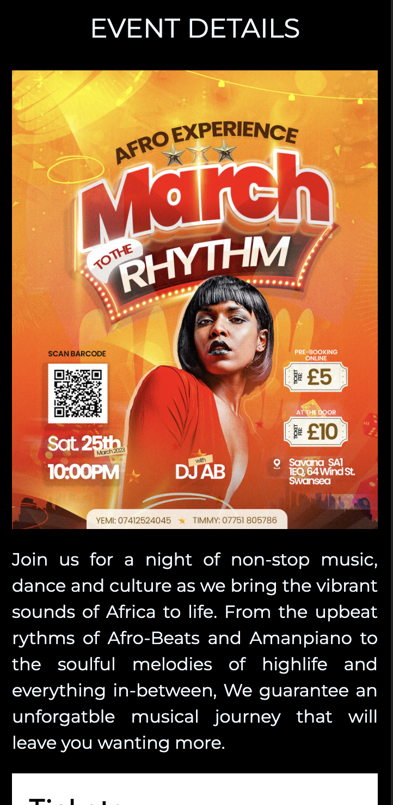
    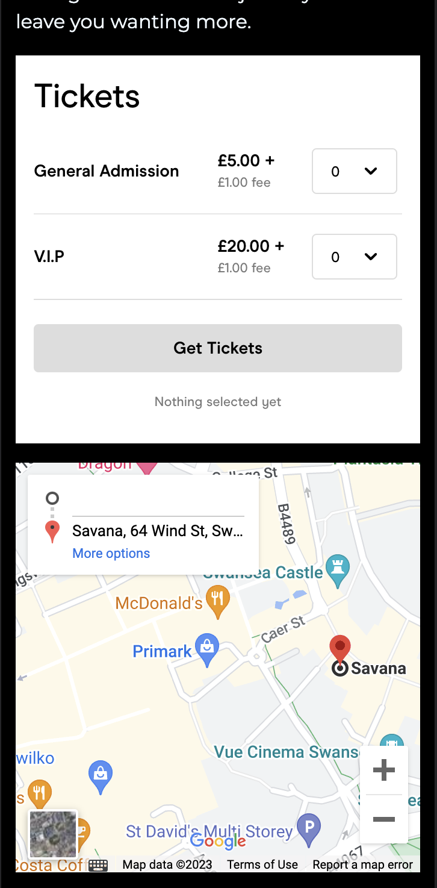

On the larger screens, the content stays the same. However, the viewport width is split into two columns using Bootstrap's `.col-md-6` class.  screenshot  is shown below.
- ### Desktop


### **Featured Performers Section**

This section has a h2 header that clearly states what the section is. The purpose of this section is to provide the user with information of the headline acts to perform in the next event. I made use of Bootstrap 5's `.card` class for each scheduled performer, and used css styling to add additional styling to the cards. On Mobile, each cards occupy an entire row and on larger screens, the cards split a row.  Screenshots are shown below.

- ### Mobile
 
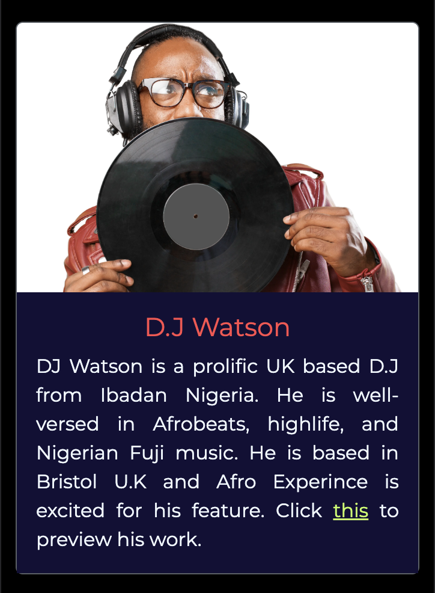

- ### Desktop
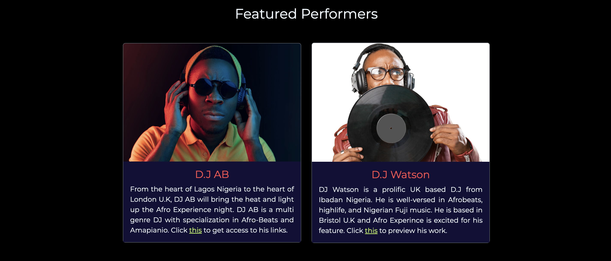

### **Attendees Quotes Section**

This section has a h2 header to title the section. The purpose of this section is to give users a sense of authenticity and validity to the website and encourage users trust. I used Bootstraps 5 `.blockquote` class in this section for each quote and it is Responsive on all devices as well. Screenshots are shown below. 

- ### Desktop
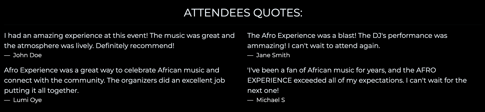
- ### Mobile
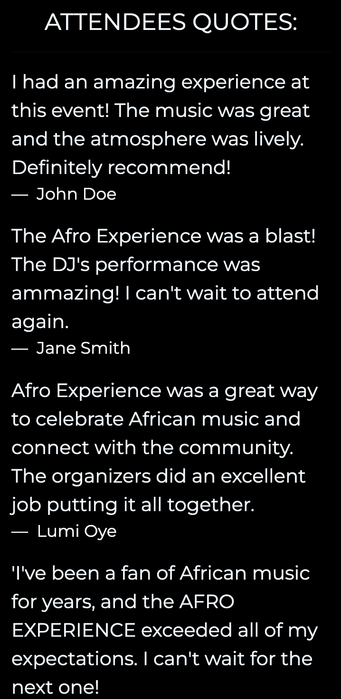


### **Footer**

The footer contains a short message to users encouraging them to connect with the event via its social platforms. This footer includes the 5 social accounts that the event organisers operate. The footer also contains copyright information. However, currently, the social links included redirects the users to nthe respective social platform homepage for the purpose of this project. 

- ### Desktop

- ### Mobile
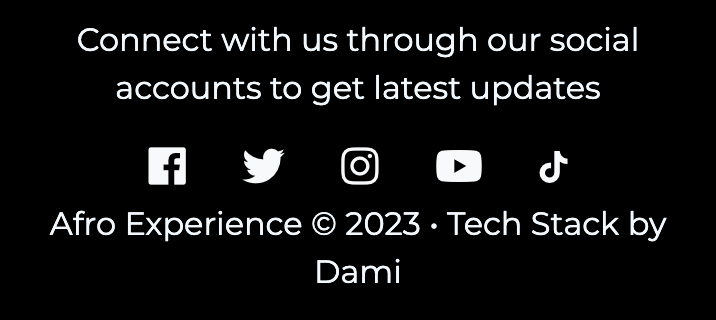

### **Gallery**

- The gallery provides the user with supporting images and to see what previous events have looked like.

- The gallery also serves as a provider of Social proof to demonstrate to users that the events are well-attended, well-organised and fun.

- The gallery section has an embedded youtube iframe that can be played from the directly from the website which plays a video already created about the event.

- The gallery section is also resposive so it displays 3 columns on dektops, 2 on Tablets and 1 on mobile.


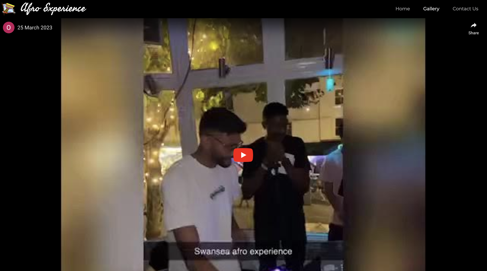


### **Contact Page**

- This page is intended to allow users who are performers and have interest in performing in an event get in touch with the organisers.
- This page is also intended to allow sponsors to contact the organisers for potential sponsorship opportunities.
- Upon submisssion of the form, the user is presented with a message which is another page `thanks.html` alerting the user that their reponse has been received. This approached was used because there is no backend set up for the website to receive and store data yet. 

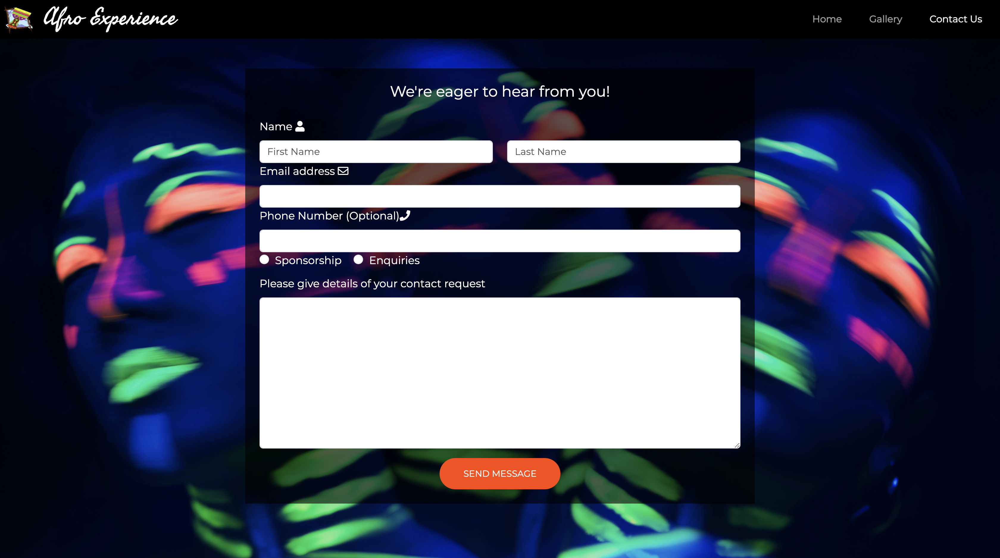


## **Responsiveness**

### Screenshots
## Mobile
#### 1. Home Page
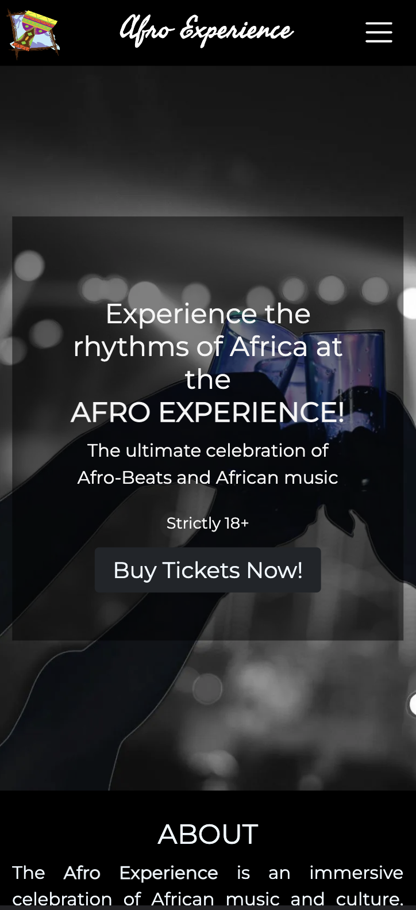
### 2. Galllery Page
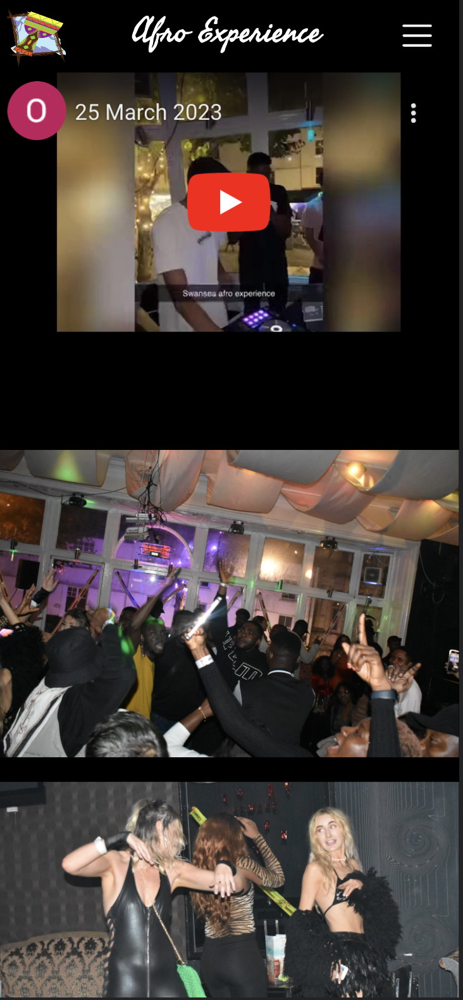
### 3. Contact Page
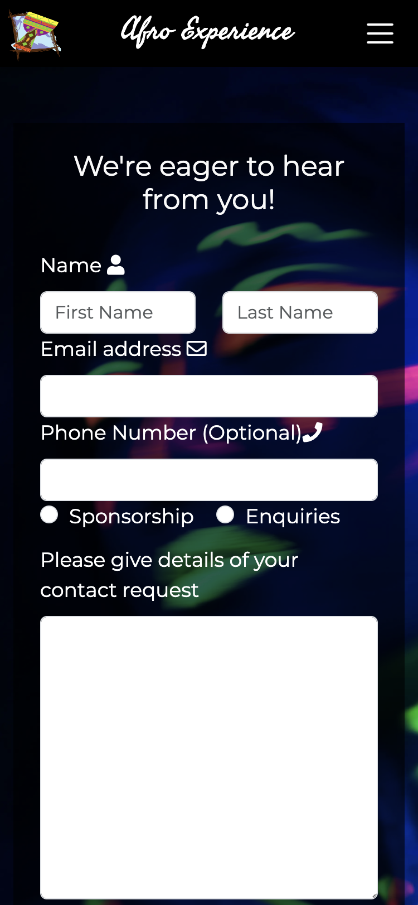

## Ipad
### 1. Home Page
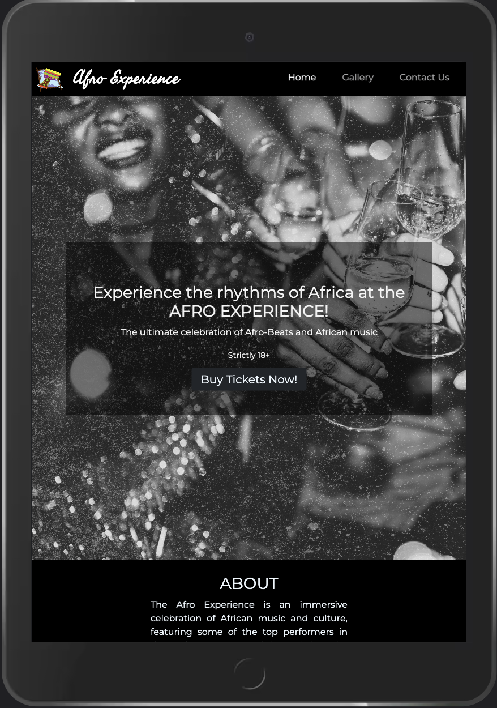
### 2. Galllery Page
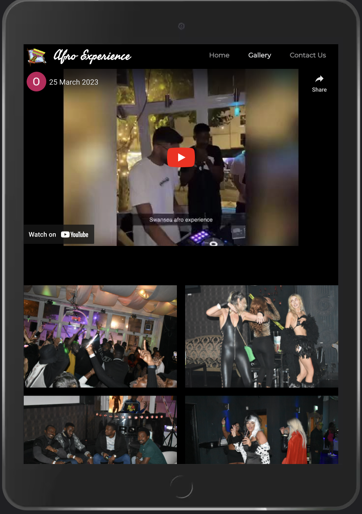
### 3. Contact Page
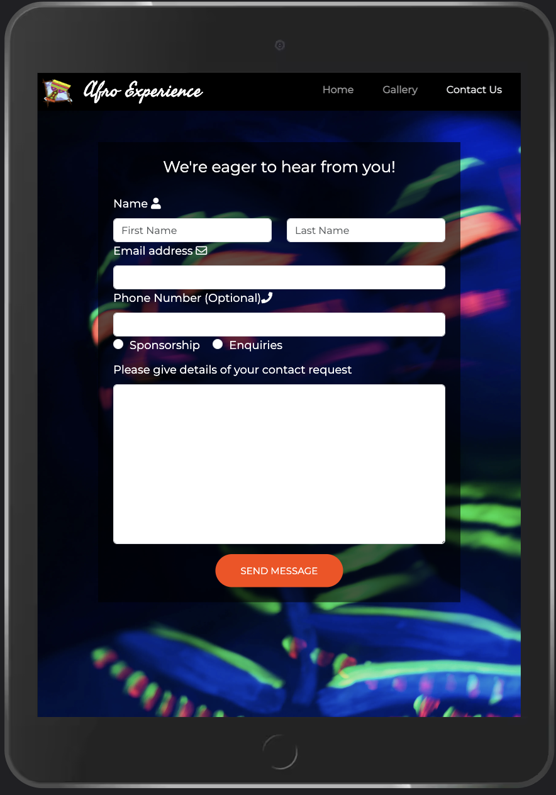

## PC
### 1. Home Page


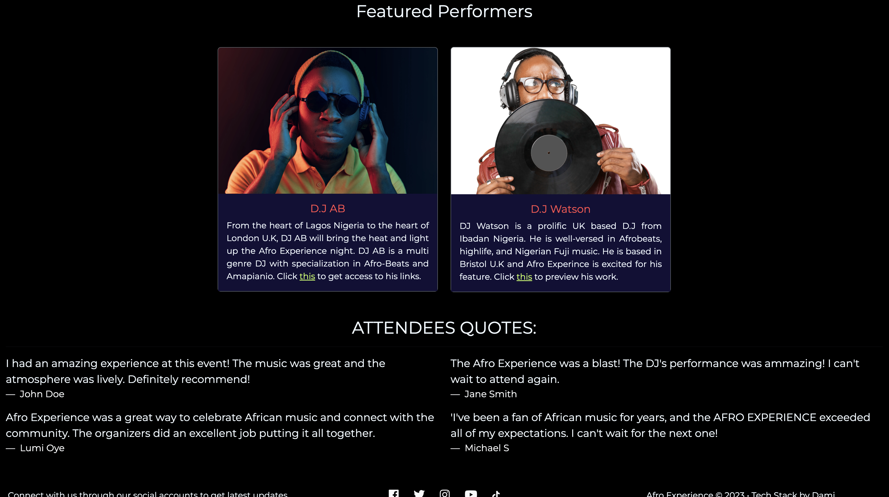
### 2. Galllery Page


### 3. Contact Page


## **Technologies Used**

### Languages Used

-   [HTML5](https://en.wikipedia.org/wiki/HTML5)
-   [CSS3](https://en.wikipedia.org/wiki/Cascading_Style_Sheets)

### Frameworks, Libraries & Programs Used

1. [Bootstrap 5.3:](https://getbootstrap.com/docs/5.3/getting-started/introduction/)
    - Bootstrap was used to assist with the responsiveness and styling of the website.
2. [Google Fonts:](https://fonts.google.com/)
    - Google fonts were used to import the 'Montserrat' and the 'Fasthand' font into the style.css file which is used on all pages throughout the project.
3.  [Visual Studio Code:](https://code.visualstudio.com/)
    - Vs Code was used to develop this website.
3. [Font Awesome:](https://fontawesome.com/)
    - Font Awesome was used on all pages to show the social media icons in the footer, and on the contact page of the website to add icons for aesthetic and UX purposes.
4. [jQuery:](https://jquery.com/)
    - jQuery came with Bootstrap to make the navbar responsive.
5. [Git](https://git-scm.com/)
    - Git was used for version control by utilizing the Visual Studio Code terminal to commit to Git and Push to GitHub.
6. [GitHub:](https://github.com/)
    - GitHub is used to store the projects code after being pushed from Git.
7. [Freepik:](https://www.freepik.com/popular-photos)
    - Freepik was used to find cool high quality pictures which was used for the background 
    - Photoshop was used to create the logo, resizing images and editing photos for the website.
8. [Balsamiq:](https://balsamiq.com/)
    - Balsamiq was used to create the [wireframes](https://github.com/) during the design process.
 
# **Future Features**


## **Testing**
    
### Testing User Stories from User Experience (UX) Section

-   #### First Time Visitor Goals

    1. As a First Time Visitor, I want to easily understand the main purpose of the site and learn more about the event.

        1. Upon entering the site, users are automatically greeted with a clean and easily readable navigation bar to go to the page of their choice. Underneath there is a Hero Image with Text and a "Buy Tickets Now!" Call to action button.
        2. The hero image is a catchy visual representation of what the event is all about.
    
    2. As a First Time Visitor, I want to be able to easily navigate through the site to buy tickets for the next event.
        
        The user has two options, click the call to action button or scroll down, both of which will lead to the same place, to learn more and buy tickets on offer to the event.

    3. As a First Time Visitor, I want to be able to easily be able to navigate throughout the site to find content.

        1. The site has been designed to be fluid and never to entrap the user. At the top of each page there is a clean navigation bar, each link describes what the page they will end up at clearly.
        2. On the Contact Us Page, after a form response is submitted, the page give the user an option to click a button that redirects to the user to the home page.

    4. As a First Time Visitor, I want to look for testimonials to understand what previous atendees think of te event and see if they are trusted. I also want to locate their social media links to see their following on social media to determine how trusted and known they are.
        1. Once the new visitor has read the about section, gone through the events details information and featured performers, they will find the "Attendees Quotes section". 
        2. The user can also scroll to the bottom of any page on the site to locate social media links in the footer.
    

-   #### Returning Visitor Goals

    1. As a Returning Visitor, I want to ensure the details and information about the event is still the same.

        This information is clearly are clearly stated in the Event details section.
        

    2. As a Returning Visitor, I want to find the best way to get in contact with the organisation with any questions I may have.

        1. The navigation bar clearly highlights the "Contact Us" Page.
        2. Here they can fill out the form on the page.
        3. The footer contains links to the organisations Facebook, Twitter, Instagram and Tik Tok pages.
        4. Whichever link they click, it will be open up in a new tab to ensure the user can easily get back to the website.


-   #### Frequent User Goals

    1. As a Frequent User, I want to check to see if there are any new events coming up.

        The user would already be comfortable with the website layout and can easily navigate to the right sections


### Further Testing

-   The Website was tested on Google Chrome, Internet Explorer, Microsoft Edge and Safari browsers.
-   The website was viewed on a variety of devices such as Desktop, Laptop, iPad Pro, iPad Air, iPhone 13, iPhone 13 Pro Max & iPhone 14 .
-   A large amount of testing was done to ensure that all pages were linking correctly.
-   Friends and family members were asked to review the site and documentation to point out any bugs and/or user experience issues.

### Bugs

- As a result of using the Bootsrap 5 hamburger icon for the mobile navbar. This did not work well with the navbar dark theme and it was impossible to see the icon.

    ### __Fix:__
    - I had to change the color using `style.css`; I used the Google chrome developer tools to access the link to the bootsrap hamburger image, and then changed the RGBA values.


-   On some mobiles and tablets, the `contact.html` page background had some distortion problems as shown below
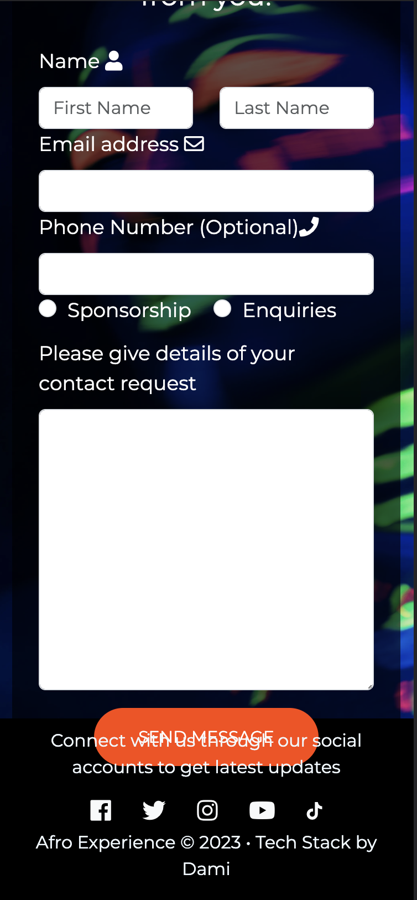
### __Fix:__
    - This was fixed by changing the display property of the page background class to `flex`


# **Validator Testing**

  ## **index.html**

  ### [The W3C Markup Validation Service](https://validator.w3.org/)

  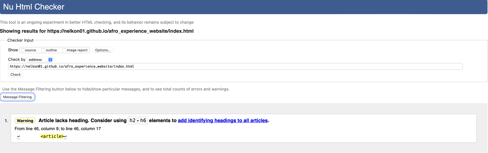

  ### Lighthouse Validation

  * Mobile

  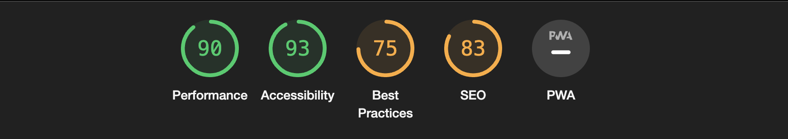

  * Desktop

  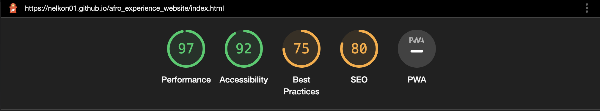


  ## **gallery.html**

  ### [The W3C Markup Validation Service](https://validator.w3.org/)

  

  ### Lighthouse Validation

  * Mobile

  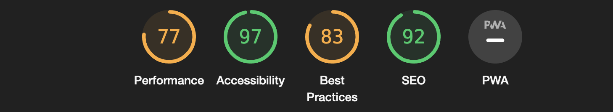

  * Desktop

  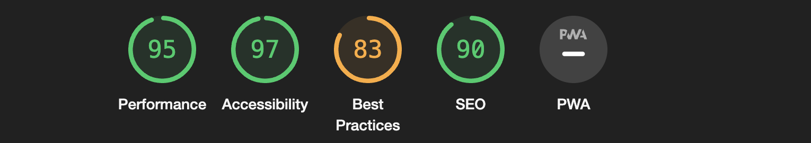


  ## **contact.html**

  ### [The W3C Markup Validation Service](https://validator.w3.org/)

  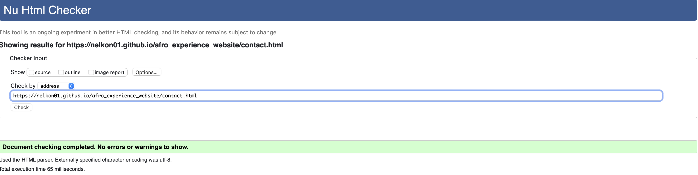

  ### Lighthouse Validation

  * Mobile

  

  * Desktop

  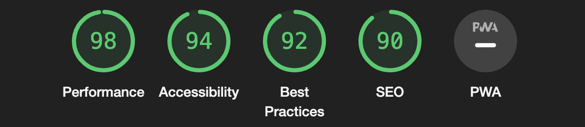
 
  
  ## **style.css**

  Passed [The W3C CSS Validation Service](https://jigsaw.w3.org/css-validator/) with no errors:

  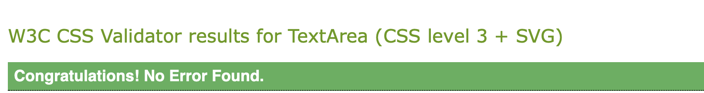

## Deployment

### GitHub Pages

The project was deployed to GitHub Pages using the following steps...

1. Log in to GitHub and locate the [GitHub Repository](https://github.com/Nelkon01/afro_experience_website)
2. At the top of the Repository (not top of page), locate the "Settings" Button on the menu.
    - Alternatively Click [Here](https://raw.githubusercontent.com/) for a GIF demonstrating the process starting from Step 2.
3. Scroll down the Settings page until you locate the "GitHub Pages" Section.
4. Under "Source", click the dropdown called "None" and select "Master Branch".
5. The page will automatically refresh.
6. Scroll back down through the page to locate the now published site [link](https://github.com) in the "GitHub Pages" section.

### Forking the GitHub Repository

By forking the GitHub Repository we make a copy of the original repository on our GitHub account to view and/or make changes without affecting the original repository by using the following steps...

1. Log in to GitHub and locate the [GitHub Repository](https://github.com/Nelkon01/afro_experience_website)
2. At the top of the Repository (not top of page) just above the "Settings" Button on the menu, locate the "Fork" Button.
3. You should now have a copy of the original repository in your GitHub account.

### Making a Local Clone

1. Log in to GitHub and locate the [GitHub Repository](https://github.com/Nelkon01/afro_experience_website)
2. Under the repository name, click "Clone or download".
3. To clone the repository using HTTPS, under "Clone with HTTPS", copy the link.
4. Open Git Bash
5. Change the current working directory to the location where you want the cloned directory to be made.
6. Type `git clone`, and then paste the URL you copied in Step 3.

```
$ git clone https://github.com/Nelkon01/afro_experience_website
```

7. Press Enter. Your local clone will be created.

```
$ git clone https://github.com/Nelkon01/afro_experience_website
> Cloning into `CI-Clone`...
> remote: Counting objects: 10, done.
> remote: Compressing objects: 100% (8/8), done.
> remove: Total 10 (delta 1), reused 10 (delta 1)
> Unpacking objects: 100% (10/10), done.
```

Click [Here](https://help.github.com/en/github/creating-cloning-and-archiving-repositories/cloning-a-repository#cloning-a-repository-to-github-desktop) to retrieve pictures for some of the buttons and more detailed explanations of the above process.

## Credits

### Code


-   [Bootstrap5](https://getbootstrap.com/docs/5.3/getting-started/introduction/): Bootstrap Library used throughout the project mainly to make site responsive and to utilize bootsrap styling.


-   The code to assist with the layout and responsiveness of the gallery page was gotten from this [CSS Tricks](https://css-tricks.com/auto-sizing-columns-css-grid-auto-fill-vs-auto-fit/#:~:text=grid%2Dtemplate%2Dcolumns%3A%20repeat(%20auto%2Dfit%2C,them%20in%20without%20any%20overflow.))


### Content

-   All content was written by the developer.

### Media

-   All Background Images was gotten from [Freepic](https://www.freepic.com)
-   The featured performers images was gotten from [Freepic]()
-   The Images and Video in the gallery.html page was taken and created by the developer form past events. 

### Acknowledgements

-   My Mentor for continuous helpful feedback.

-   Tutor support at Code Institute for their support.